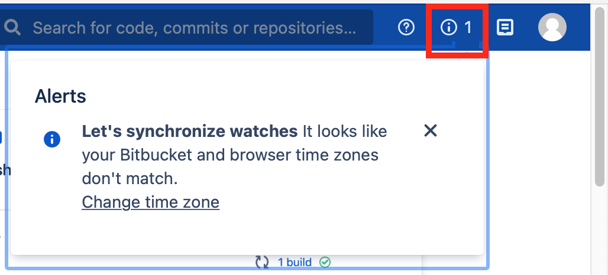

# Bitbucket Login

Lab Objectives:
- Log into Bitbucket lab instance
- Optionally adjust account settings
- Get oriented in Bitbucket

## Lab

### Log into Bitbucket

Using the URL and credentials provided to you by the instructor, log into to the Bitbucket lab instance.  After logging in, you will see the "Welcome to Bitbucket" splash page.

### Adjust account settings

#### Set your time zone

After logging in, you might see an alert about setting your time zone.  If you see the alert in the upper right top menu section, click on the alert and optionally change your time zone.

> If you don't see the alert, then your browser might be set to GMT time zone.

#### Upload your SSH key (Optional)

If you want to use SSH to push and pull code to and from Bitbucket, you can upload your public SSH key now.

Click on your avatar icon in the upper right top menu bar.  In the drop down menu, select `Manage account`.  Then in the left hand menu pane, select `SSH keys`.

To upload your SSH key, click the blue `Add key` button on the page.  This will open the "Add public key" page.  In the text box, paste in your &ast;**public**&ast; SSH key (ends in `.pub`), then click `Add key`.

### Navigate to a project and repository

In the top menu bar, click on the `Projects` menu item.  This will open a page listing the projects you can see.  There should be only one project "Demos".

Click on the "Demos" project name.  This will open a page listing the repositories in the project that you can see.  There should be one repository "Training One".

Click on the "Training One" repository name.  This will open a page from which you can explore the repository contents.  That's as far as we want to go in this lab &mdash; we will be covering all the menu items and operations in detail after this lab.
