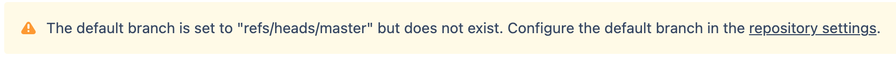

# Project and Repository

Lab Objectives:
- Create a project
- Create a repository
- Import a repository

## Prerequisites

You should have created a Git repository on your local machine in Lab 1.1.  (Having done Lab 1.2 is desirable but not necessary.)

You should have logged into the Bitbucket lab instance in Lab 2.1.

## Lab

### Create a project

In Bitbucket, click on the `Projects` menu item in the top menu bar.  This will open the projects list page.

Find the `Create project` button in the upper right and click that button.  A "Create a project" form page will open. Fill in the fields:
* Project name - "Training Labs"
* Project key - Change to "TRL"
* Description - "Repositories from Bitbucket training"

Click the `Create project` button.  A project list page will show with the message "There are no repositories in this project yet".

### Create a repository

#### Create the repository in Bitbucket

On the project page, click the `Create repository` menu item in the left menu panel.  A form page will open.  Fill in the fields:
* Name - "Bitbucket Lab"
* Default branch name - "main" (This will override the system default of "master".)
* Description - "Training repository for Bitbucket labs."

Click the `Create repository` button.  A repository page will show up with the message "You have an empty repository".  The page will have instructions on ways to populate the repository with initial content.  Read through the instructions for the different methods.

#### Populate repository content in Bitbucket

Recall that in Lab 1.1 you created a repository on your local machine.  We will use that local repository to populate the new repository in Bitbucket.

In the instructions shown on the repository page in Bitbucket, find the section titled "My code is ready to be pushed".  We will be using a couple of commands from this section. (We already did the init, add, and commit operations back in Lab 1.1.)

1. On you local machine, in a terminal window go to the repository directory you created in Lab 1.1.
2. In the local repository, make sure you are on the "master" branch.  (If you are not, then execute `git switch master`.)
3. From the Bitbucket instructions, copy the entire command line that starts with "git remote add origin". The URL portion of the line will be either ssh or https depending on whether or not you uploaded an SSH key.  (Bitbucket is smart that way.)  Paste the command into the terminal window on your local machine and execute it.  Optionally, then execute `git remote -v` to confirm the remotes have been set.
4. From the Bitbucket instructions, copy the entire command line `git push -u origin HEAD:main`.  Paste the command into the terminal window on your local machine and execute it. (The `HEAD:main` part of the command maps the local branch "master" to the "main" branch that was set as default in the Bitbucket repository.)  Also note that this command only pushed the "master" branch to Bitbucket.  We could have pushed all the branches by suffixing the command with `--all` but usually (though not necessarily always) we want a clean start of code in Bitbucket.

In Bitbucket, click on the `Commits` menu item in the left menu panel.  Notice that the commit graph looks like the graph you saw on the command line at the end of Lab 1.2.

### Import a repository

Go back to the project page.  You can get there from a repository page in a few different ways: (1) click on the `Projects` menu in the top menu bar; (2) click on the "Training Labs" link in the breadcrumb train along the top of the page; or (3) click on the "Training Labs" link above the repository name at the top of the left menu panel.

On the projects page, click the `Import registry` menu item in the left menu panel.  An import form page will open.

The repository we will import is the GitHub repository you are already accessing for the instructions to these labs.

Importing from Bitbucket Cloud or GitHub require access credentials.  Since we will import a public repository from GitHub, select the "Git" option as the source to import from.

In the Clone URL field, paste in the clone URL for the GitHub repository: https://github.com/CprimeLearningLabs/bitbucket-selfhosted.git

Click the `Import repository` button.  The imported repository will now show up on the project page.

Click on the "bitbucket-selfhosted" repository name in the repository list.  This will open the repository view.  Chances are that you see an error message:

The reason for this error is that the *default* default branch for a new repository is "master", but the imported repository does not have a "master" branch.  We will discuss the default branch setting later, but for now you can fix this error as follows:
- Click on the "repository settings" link.
- On the Repository details page that appears, change the Default branch setting to "main".  Then click `Save`.
- Click the `Source` menu item in the left menu panel.  The repository code should now show up as expected.
